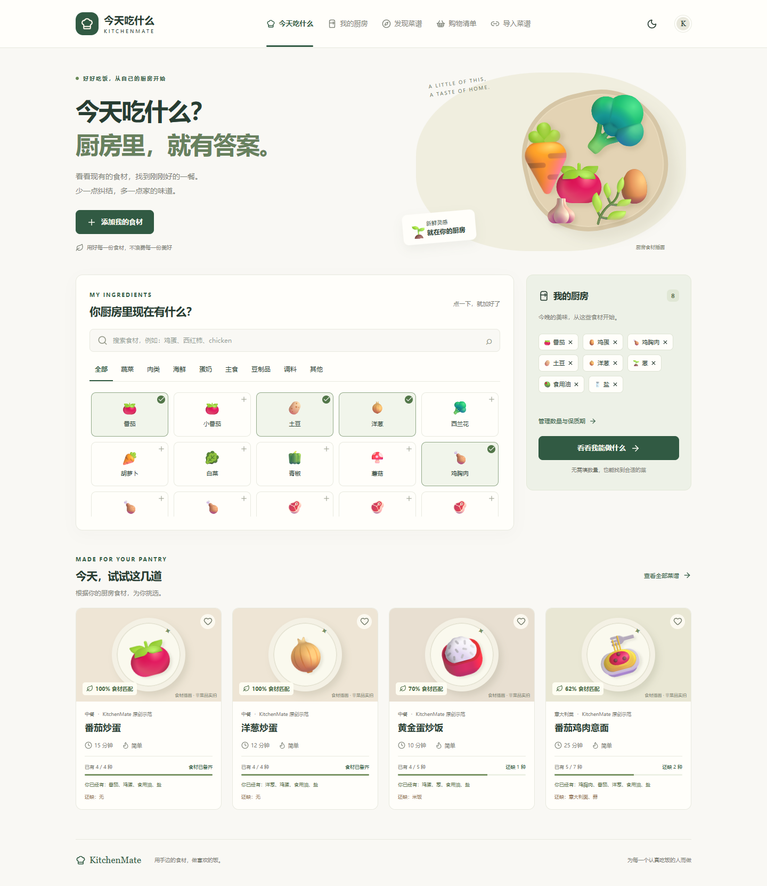
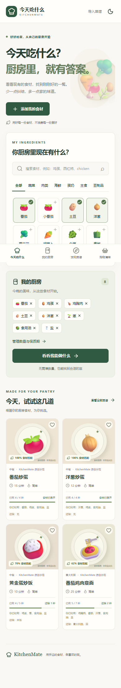
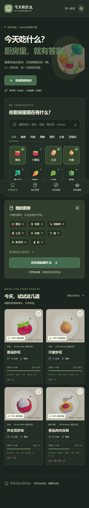

# 今天吃什么 · KitchenMate

从自己的厨房出发，找到今晚的一餐。一个中文优先、可运行的 Next.js 全栈 MVP：**Pantry → 食材标准化 → 匹配推荐 → 菜谱详情 → Cooking Mode → 购物清单**。

无数据库、无 API key 也可完整体验核心流程。12 道独立编写的示范菜谱用于离线来源与故障降级，不是业务逻辑的唯一数据源。第一次打开会载入可清空的示范厨房。

## Screenshots



<details><summary>手机与深色模式</summary>




</details>

## 已实现

- 49 种常用食材，中英文与别名匹配，类别筛选和即时搜索。
- 本机 Pantry：数量、单位、保质期、存放位置、创建/更新时间；localStorage 持久化。
- 四种推荐模式、核心食材高权重、临期库存优先、已有与缺少食材明细。
- 时间、难度、菜系、饮食标签、过敏原、厨具筛选；菜名/别名/食材/标签搜索与收藏。
- 详情与动态份量换算；来源标注；只输出掌握的 JSON-LD 数据，不伪造评分、营养或评论。
- 大字单步烹饪、多独立计时器、上一步/下一步、结束状态及 Wake Lock（浏览器支持时）。计时以绝对截止时间计算，后台节流不会让倒计时变慢。
- 缺料加入购物清单、同食材同单位合并、分类、勾选与删除。
- TheMealDB、独立 URL 导入、可选 AI 三候选生成；外部失败保留本地内容。
- 响应式、深色模式、键盘焦点、语义标签、选中标记；安装 manifest。

## 如何运行

需要 Node.js 22+，推荐 Node.js 24。

```bash
npm install
npm run dev
```

打开 http://localhost:3000。也可以用已提交锁文件：

```bash
pnpm install --frozen-lockfile
pnpm dev
```

生产构建：

```bash
npm run build
npm start
```

可部署到 Vercel 的 Next.js Node runtime 或普通 Node 服务。URL 导入使用 DNS/HTTPS Node API，不能放到 Edge runtime。项目没有自动发布到公网。

## 环境变量

复制 `.env.example` 为 `.env.local`，按需设置，不要提交凭证。

| 变量                     | 默认与用途                                                                             |
| ------------------------ | -------------------------------------------------------------------------------------- |
| `DATABASE_URL`           | 空：使用进程内菜谱详情缓存；填写后启用 PostgreSQL Repository。                         |
| `THEMEALDB_API_KEY`      | 生产 API key，仅服务端读取。                                                           |
| `THEMEALDB_USE_TEST_KEY` | `false`；本地开发设为 `true` 才使用官方测试 key `1`。生产会忽略这个选项。              |
| `LLM_API_KEY`            | 可选；无 key 时 AI 按钮明确提示，普通推荐不受影响。                                    |
| `LLM_BASE_URL`           | 默认为 `https://api.openai.com/v1`；需兼容 Chat Completions + JSON object 输出的服务。 |
| `LLM_MODEL`              | 示例 `gpt-4.1-mini`，请使用自己账户可访问且支持 JSON 输出的模型。                      |

在线搜索在“发现菜谱 → 查找在线菜谱”显式触发。中文关键词可能不被英文来源理解；空搜索会根据厨房里前 3 种食材查询，或输入英文菜名。环境变量修改后重启开发服务。

## 架构

```text
app/                  Next.js 路由、API、共享布局
components/           页面交互与展示
lib/model.ts          Zod Normalized Recipe / Pantry / Shopping schema
lib/ingredients.ts    规范食材、别名、类别与示范厨房
lib/matching.ts       纯函数匹配与搜索
lib/units.ts          单位、份量与分数数量
lib/providers.ts      统一接口、Aggregator、Local、TheMealDB、下厨房占位
lib/url-import-provider.ts / recipe-parser.ts / safe-fetch.ts
lib/ai-provider.ts    结构化生成、规范化和一次重试
lib/db/               Repository、Drizzle PostgreSQL schema
drizzle/              可执行 SQL migration
tests/                unit / API integration / opt-in live / Playwright
docs/                 研究、依赖许可、实际截图
```

共享客户端布局保存当前交互状态；所有来源统一返回 `Recipe`（即 NormalizedRecipe），UI 不依赖 TheMealDB 原始字段。导入与 AI 生成只在用户操作时发生，不参与后台爬取或自动 LLM 请求。外部菜谱详情打开后保存在本机，可刷新恢复。

### Recipe Provider Architecture

`RecipeProvider` 定义 `id / name / enabled / search / getRecipe / searchByIngredients / normalizeRecipe`。`RecipeAggregator` 对启用的搜索来源使用 `Promise.allSettled`，去重并单独返回警告。新增来源只需实现接口并注册，不改核心 UI 或匹配引擎。

| Provider                  | 状态                                                    |
| ------------------------- | ------------------------------------------------------- |
| LocalRecipeProvider       | 默认可用，12 道完整示范菜谱。                           |
| TheMealDBProvider         | 已实现官方 API；线上需合法 key。                        |
| ExternalUrlImportProvider | 已实现公开 URL 的结构化解析；导入结果存入本机收藏数据。 |
| AIRecipeProvider          | 已实现可选生成；Zod 校验、最多一次重试、失败降级提示。  |
| XiachufangProvider        | `enabled=false`，没有爬虫或私有 API。                   |

TheMealDB fetch 结果通过 Next.js Data Cache 缓存 30 分钟；详情 API 使用 Repository 缓存 24 小时，刷新失败可返回旧缓存。未配置数据库的详情缓存只活在当前进程，最多 500 条。个人导入、Pantry、购物清单与收藏是设备本地数据，不假装已同步到账号。

### Ingredient Matching Algorithm

必需核心食材权重 `1`，盐/糖/水/油/黑胡椒权重 `0.15`。匹配分数 = 已有必需食材权重之和 / 全部必需食材权重之和 × 100。可选食材不扣分；未识别食材保留 `unknown:` 标识，不能无故算作已拥有。

“现在就能做”要求缺少核心食材为 0，仍清楚显示缺少的调料。“只差一点”要求缺 1–2 个核心食材。“消耗库存”按已有非基础食材数量加临期使用奖励排序，临期定义为未来 3 天内。数量不参与可做性判断，份量换算不等于库存扣减。过敏原筛选对来源信息不完整的外部菜谱采取保守排除，不提供医疗保证。

## 数据库配置

提供 User、Ingredient、IngredientAlias、PantryItem、Recipe、RecipeIngredient、RecipeInstruction、Favorite、ShoppingList、ShoppingListItem、RecipeImport 共 11 张表。

`canonicalName` 唯一索引；`sourceProvider + externalId` 唯一约束；Pantry 的 user/ingredient、导入的 user/url、步骤的 recipe/step 都有唯一约束；关系使用外键。Recipe 的完整规范化文档保存在 JSONB，支持未知外部食材与未来扩展，避免强行创建错误字典记录。

配置环境变量后运行（Drizzle CLI 从进程读取 `DATABASE_URL`，如使用 `.env.local` 需通过 shell 或 dotenv 载入）：

```bash
npm run db:migrate
```

模型变更后运行 `npm run db:generate`。当前 PostgreSQL adapter 用于服务端菜谱缓存。账号认证、用户授权和 Pantry 云同步属于下一阶段；数据库结构已预留，MVP 不开放不安全的匿名用户数据 API。未在此环境连接真实 PostgreSQL，迁移已生成但未实库执行。

## Recipe URL Import 工作方式

1. 服务端限长读取输入，Zod 校验与同源检查。
2. 只允许 HTTPS 443，无用户名密码；禁止 localhost、私有、环回、链路本地、元数据及保留 IP，覆盖 IPv4/IPv6 与 IPv4-mapped IPv6。
3. DNS 解析全部地址，任何非公网地址都拒绝；连接固定已验证地址、保留 TLS hostname，防 DNS rebinding。
4. 重定向最多 3 次，每跳重复检查；请求超时 8 秒、绝对下载期限 10 秒/跳、最大 HTML 2MB、验证 Content-Type。
5. JSON-LD Recipe 优先，支持 @graph 与 HowToSection；Microdata 后备，OpenGraph 仅补充已有 Recipe 的标题和图片。
6. 外部文本去除 HTML，仅以文本呈现。JSON-LD 输出转义 `<`，不存在任意外部 HTML 注入。URL SHA-256 作为稳定导入 ID，重复导入更新同一记录。

导入器不是通用网站绕过器，无法解析的页面返回可理解的错误。当前限流为进程内全局预算（搜索 90 次/分钟、导入 10 次、AI 5 次），多实例生产部署应在网关增加共享限流、流量配额和认证后再开放昂贵 AI 能力。

## 图片与数据来源限制

本地菜谱使用标注“食材插画 · 非菜品实拍”的统一占位视觉，没有用随机照片冒充菜品。TheMealDB 图片与其菜谱保持来源关系；导入图片保留原网站来源。代码 MIT 许可不覆盖第三方菜谱、照片、商标或服务条款。

AI 菜谱始终标注生成来源，提醒检查变质、过敏原、加热和特殊人群饮食风险。此环境未提供 LLM key，因此没有做付费模型的真实生成验收；无 key 降级可直接测试。

## Xiachufang Integration

系统已预留 `XiachufangProvider`，默认禁用。只有在拥有符合其服务条款的官方 API / 授权 / 合法数据访问方式后才启用。没有模拟 App 私有接口、绕过登录/验证码或大规模抓取实现。

## 测试

```bash
npm run lint
npm run typecheck
npm test
npm run build
```

浏览器测试需要先运行 `npm run dev`，默认使用已安装 Chrome：

```bash
npm run test:e2e
```

也可以安装 Playwright Chromium，然后将配置中的 `channel` 改为空。核心流程覆盖清空/添加 Pantry、刷新持久化、推荐、2 → 4 人份、购物清单、两个并发计时器、前后步骤及完成。另测手机无横向溢出、深色模式和桌面截图。

可选联网验收（不在普通 CI 中自动访问外部服务）：

```powershell
$env:LIVE_PROVIDER_TESTS='true'
npm test -- tests/live.test.ts
```

已实际验证官方 TheMealDB 测试 API 与 DNS 固定的公开 HTTPS 下载；故障降级用可重复的测试 Provider 验证。

## MVP 边界与后续路线

- Pantry 与私人菜谱目前是单设备本地数据；下一阶段接入认证、授权和 PostgreSQL 同步。
- 当前 UI 完整中文；`lib/i18n.ts` 预留 locale 类型，中英文食材已支持；英文 UI 尚未翻译。
- 有安装 manifest；未实现 Service Worker 离线页面缓存。不能承诺断网刷新页面仍能打开；已打开页面的本地推荐可继续使用。
- 没有 AI 自动翻译、食材替换、补救问答、库存扣减、周计划、社交或付费功能。
- 建议下一阶段先做合法中文数据接入、共享限流/服务监控，再做云同步与 AI Cooking Assistant。

## Credits / References / License

参考 [Mealie](https://github.com/mealie-recipes/mealie)、[Tandoor Recipes](https://github.com/TandoorRecipes/recipes)、[RecipeSage](https://github.com/julianpoy/RecipeSage)、[recipe-scrapers](https://github.com/recipe-scrapers/recipe-scrapers)。仅借鉴架构与工作流，没有复制强 copyleft 或商业限制代码。完整研究见 [RESEARCH.md](docs/RESEARCH.md)，直接依赖许可证见 [DEPENDENCIES.md](docs/DEPENDENCIES.md)。本站原创代码采用 [MIT](LICENSE)。
